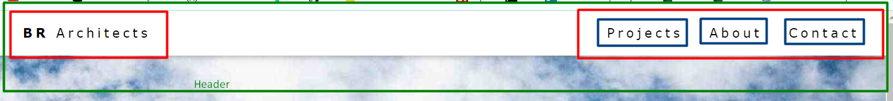

# Flex box

1. https://css-tricks.com/snippets/css/a-guide-to-flexbox/ 2.https://www.w3schools.com/w3css/tryw3css_templates_architect.htm darom taip 

## praktika

1. https://flexboxfroggy.com/ flex zaidimas
2. https://flukeout.github.io/ - css zaidimas
3. https://www.w3schools.com/w3css/tryw3css_templates_architect.htm architektu puslapis
4. tiems kad viska pasidaret sunkesne tolimesne uzduotis https://preview.colorlib.com/theme/raptor/
5. tiems kas norit rimtesni zaidimuka pazaist nei varlytes https://mastery.games/post/flexboxzombies2/ reikia uzsiregistruot ir nemokamai galesite pazaist.
